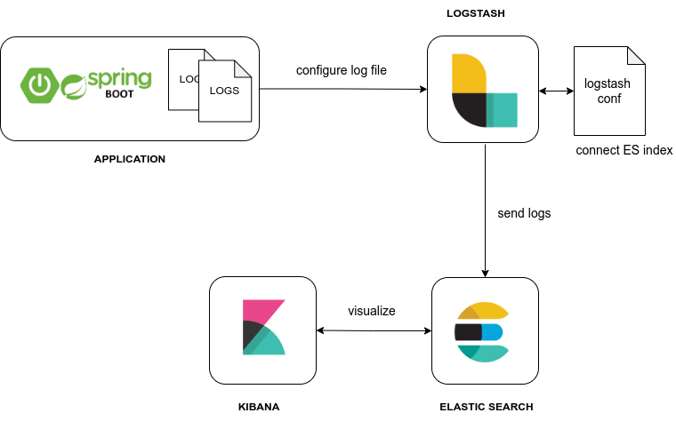
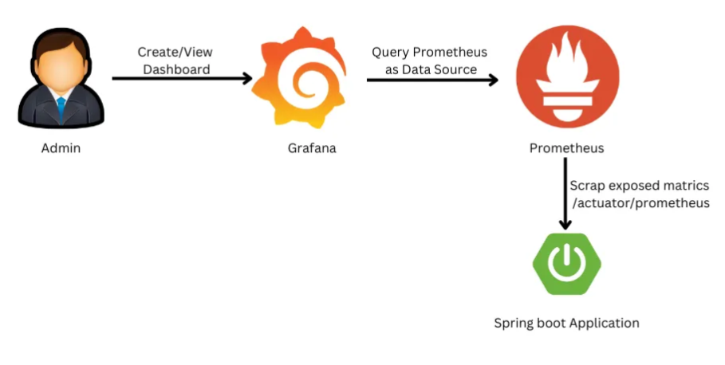
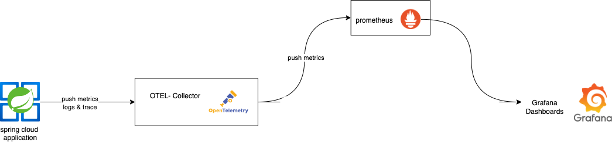
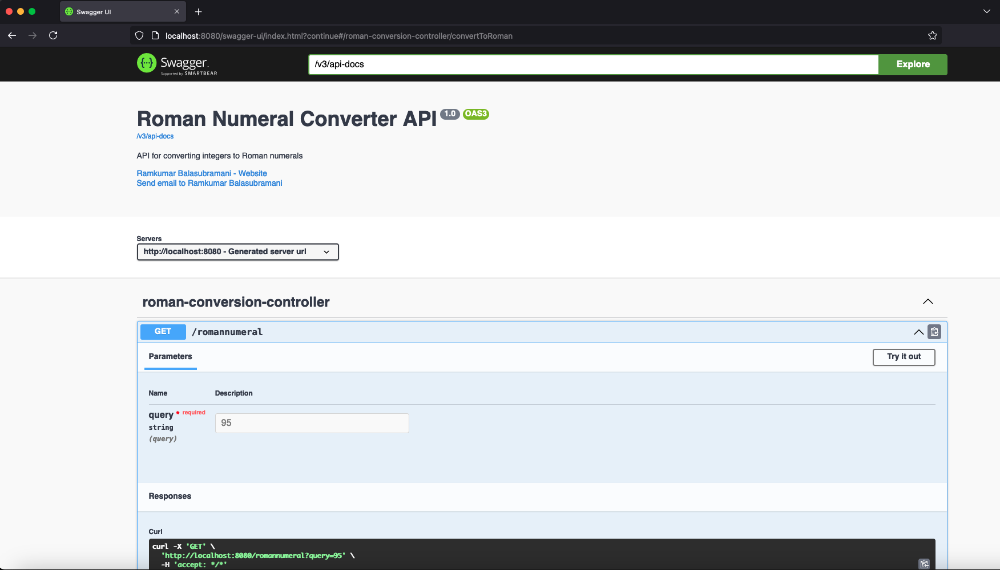
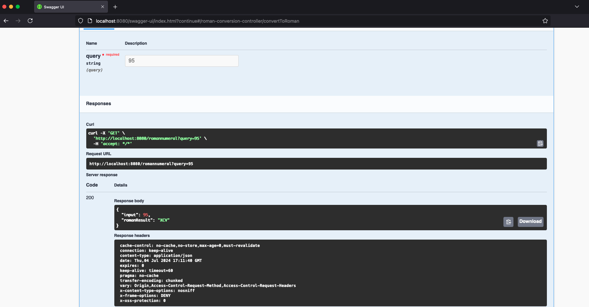
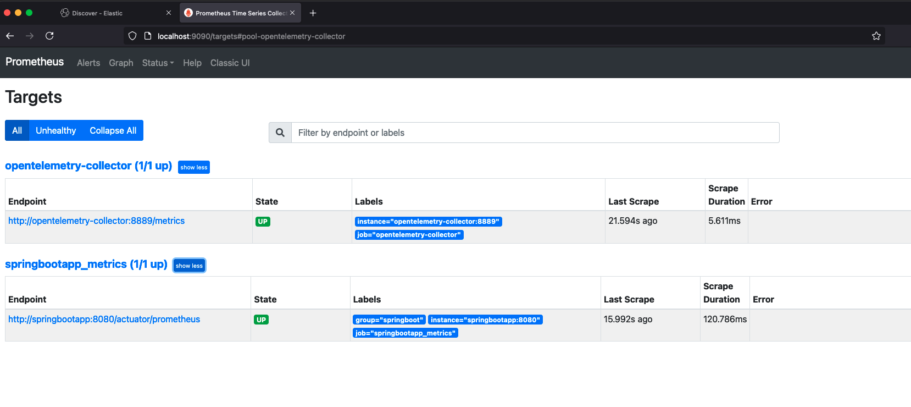
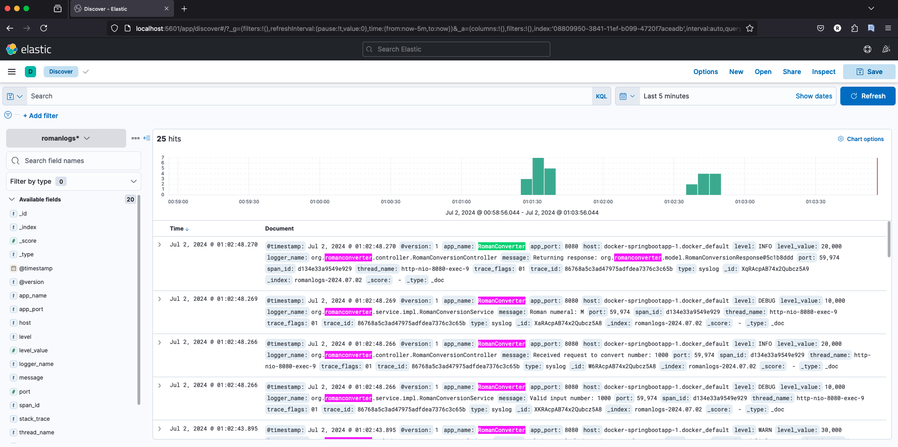
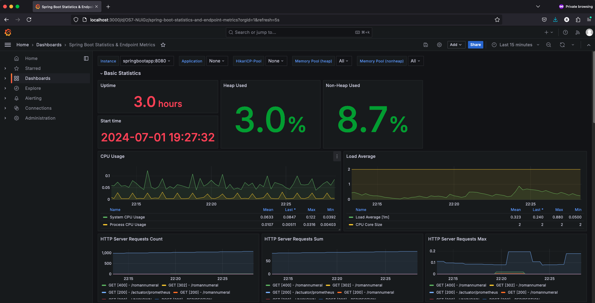
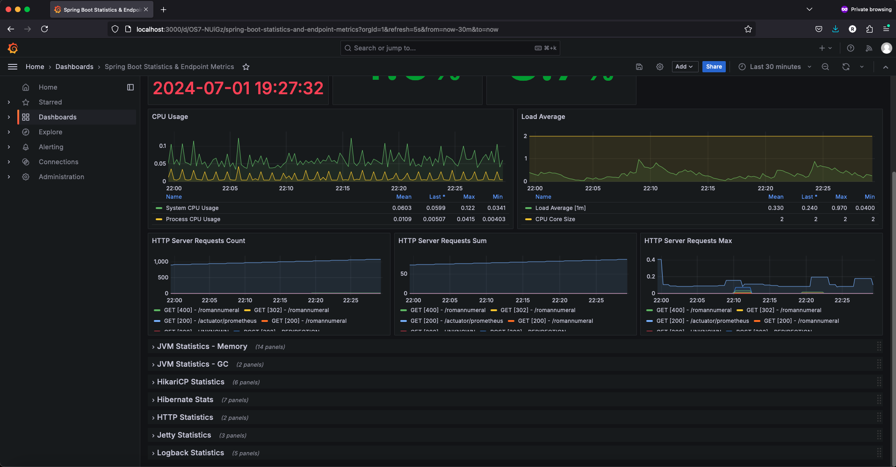
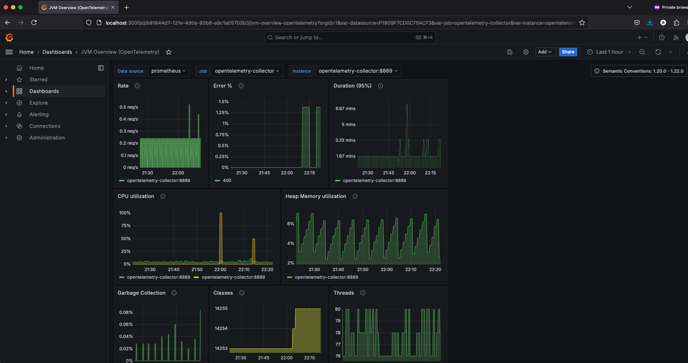

# RomanConverter
RomanConverter is a Spring Boot application that converts numbers to Roman numerals. This project includes various components such as Docker, Elasticsearch, Grafana, Kibana, Logstash, and OpenTelemetry for monitoring and logging purposes.

## **Author**
   - **Name:** Ram Kumar Balasubramani
   - **Email:** ram.06cs@gmail.com 

## Table of Contents
1. [Project Overview](#1-project-overview)
    - 1.1 [Logging Architecture](#11-logging-architecture)
    - 1.2 [Metrics Architecture](#12-metrics-architecture)
    - 1.3 [Monitoring Architecture](#13-monitoring-architecture)
2. [Getting Started](#2-getting-started)
    - 2.1 [Prerequisites](#21-prerequisites)
    - 2.2 [Installation](#22-installation)
3. [Service Endpoints](#3-service-endpoints)
4. [Application Usage and Monitoring](#4-application-usage-and-monitoring)
    - 4.1 [Access Application via REST Endpoint](#41-access-application-via-rest-endpoint)
    - 4.2 [Access Swagger](#42-access-swagger)
    - 4.3 [Access Prometheus](#43-access-prometheus)
    - 4.4 [View Logs from Kibana](#44-view-logs-from-kibana)
    - 4.5 [Monitoring Metrics via Grafana](#45-monitoring-metrics-via-grafana)
5. [Running Test Suite](#5-running-test-suite)
6. [Shutting Down the Services](#6-shutting-down-the-services)
7. [Project Structure](#7-project-structure)
8. [References](#8-references)


## 1. **Project Overview**
  
The RomanConverter project utilizes several components for robust functionality, monitoring, and logging. Below are concise descriptions of each component:

**Spring Boot Application**

    Description: java application responsible for converting numbers to Roman numerals

    Role: Provides RESTful endpoints for number to roman numeral conversion

    Key Features:
        Provides a REST API
        Implements error handling
        Integrates with monitoring and logging tools

**Docker**

    Description: Containerization platform used to encapsulate the entire application stack

    Role: Ensures consistency across different environments and simplifies deployment

    Key Features:
        Docker Compose for orchestration
        Isolated containers for each service


### 1.1 **Logging Architecture**




**Logstash**

    Description: Server-side data processing pipeline

    Role: Ingests, transforms, and forwards logs to Elasticsearch

    Key Features:
        Centralized logging
        Data transformation and enrichment


**Elasticsearch**

    Description: Distributed search and analytics engine

    Role: Stores and indexes logs and metrics

    Key Features:
        Fast search and analysis
        Real-time indexing

**Kibana**

    Description: Data visualization dashboard for Elasticsearch

    Role: Visualizes and explores logs and metrics stored in Elasticsearch

    Key Features:
        Customizable dashboards
        Real-time visualization


### 1.2 **Metrics Architecture**



**Prometheus**

    Description: Open-source systems monitoring and alerting toolkit

    Role: Prometheus scrapes metrics from
       1.Spring Boot Actuator (http://localhost:8080/actuator)  
         Metrics like application JVM metrics, HTTP request statistics

       2. OpenTelemetry (http://localhost:4317)
          Metrics like CPU usage, Memory usage and other performance metrics
    
    Key Features:
      Efficient storage and retrieval of time-series data
      Powerful query language (PromQL) for querying metrics
      Time series collection via pull model over HTTP

### 1.3 **Monitoring Architecture**



**OpenTelemetry**

    Description: Opensource Framework for observability and collecting metrics

    Role: Exports application metrics for comprehensive observability

    Key Features:
        Unified observability framework
        Support for multiple backends
        Easily integrates with existing monitoring tools

**Grafana**

    Description: Monitoring and observability platform

    Role: Queries, visualizes, and alerts on metrics from multiple sources

    Key Features:
        Customizable dashboards
        Integration with various data sources
        Alerting and notifications


## 2. **Getting Started**

### 2.1 **Prerequisites**
Ensure that the following software is installed on your system and environment variables are set
   - Java 17 or later
   - Apache Maven 3.9.4 or later
   - Docker version 26.1.0-rd or later
   - Docker Compose version v2.27.1 or later
    
   ```sh
   java -version
   mvn -v
   docker version
   docker-compose version
   ```

Additionally, make sure that the following ports are not used by other applications and are available:

    9200, 9300 (Elasticsearch)
    5000, 9600 (Logstash)
    5601 (Kibana)
    8080 (Spring Boot Application)
    9090 (Prometheus)
    3000 (Grafana)
    4317, 13133, 8889 (OpenTelemetry Collector)

This ensures that there are no port conflicts when starting the services.

### 2.2 **Installation Steps**

1. Clone the Repository 
    ```sh
    git clone https://github.com/ram06cs/RomanConverter
    cd RomanConverter
    ```
2. Build the Springboot Application

   Perform a Maven build inside the project directory to generate JAR files and dependencies:

    ```sh
    cd RomanConverter
    mvn clean install -U
    ```

3. Navigate to the docker directory

   Once the build is successful, Navigate to the `docker` directory.

     ```sh
    cd RomanConverter
    mvn clean install -U
    ```

      
4. Start the services using docker-compose
    
   ````sh
    docker-compose up -d --build
   ````
    
    The command would create following containers:

   ````sh
    [+] Running 8/8
    ✔ Network docker_default                      Created  0.1s
    ✔ Container docker-elasticsearch-1            Started  1.0s
    ✔ Container docker-prometheus-1               Started  1.0s
    ✔ Container docker-opentelemetry-collector-1  Started  1.7s
    ✔ Container docker-logstash-1                 Started  1.6s
    ✔ Container docker-kibana-1                   Started  1.3s
    ✔ Container docker-grafana-1                  Started  1.7s
    ✔ Container docker-springbootapp-1            Started  1.9s
   ````

5. Verify if all the services are up and running

   You should see an output similar to this:

    ```sh
    docker-compose ps
    ```

   Example output:

    ```plaintext
    rambala-macbook-pro:docker rambala$ docker-compose ps
    NAME                               IMAGE                                                  COMMAND                  SERVICE                   CREATED         STATUS                   PORTS
    docker-elasticsearch-1             docker.elastic.co/elasticsearch/elasticsearch:7.17.5   "/bin/tini -- /usr/l…"   elasticsearch             2 minutes ago   Up 2 minutes (healthy)   0.0.0.0:9200->9200/tcp, :::9200->9200/tcp, 0.0.0.0:9300->9300/tcp, :::9300->9300/tcp
    docker-grafana-1                   grafana/grafana:8.4.3                                  "/run.sh"                grafana                   2 minutes ago   Up 2 minutes             0.0.0.0:3000->3000/tcp, :::3000->3000/tcp
    docker-kibana-1                    docker.elastic.co/kibana/kibana:7.17.5                 "/bin/tini -- /usr/l…"   kibana                    2 minutes ago   Up 2 minutes             0.0.0.0:5601->5601/tcp, :::5601->5601/tcp
    docker-logstash-1                  docker.elastic.co/logstash/logstash:7.17.5             "/usr/local/bin/dock…"   logstash                  2 minutes ago   Up 2 minutes             0.0.0.0:5000->5000/tcp, :::5000->5000/tcp, 0.0.0.0:9600->9600/tcp, :::9600->9600/tcp, 5044/tcp
    docker-opentelemetry-collector-1   otel/opentelemetry-collector:0.56.0                    "/otelcol --config /…"   opentelemetry-collector   2 minutes ago   Up 2 minutes             0.0.0.0:4317->4317/tcp, :::4317->4317/tcp, 0.0.0.0:8889->8889/tcp, :::8889->8889/tcp, 0.0.0.0:13133->13133/tcp, :::13133->13133/tcp, 55678-55679/tcp
    docker-prometheus-1                prom/prometheus:v2.33.5                                "/bin/prometheus --c…"   prometheus                2 minutes ago   Up 2 minutes             0.0.0.0:9090->9090/tcp, :::9090->9090/tcp
    docker-springbootapp-1             romanconverter/springbootapp                           "/bin/sh -c 'java -j…"   springbootapp             2 minutes ago   Up 2 minutes             0.0.0.0:8080->8080/tcp, :::8080->8080/tcp
    ```

   Allow a few minutes for all containers to start. Ensure no port conflicts to avoid issues. Verify the status with:

    ```sh
    docker-compose ps
    ```

   Repeat the command until all containers are up and running.


## 3. **Service Endpoints**

- **Spring Boot Application:**
    - **Security Configuration:**
        - Spring Security is configured to secure the application.
        - The `/actuator` endpoint is configured without authentication for metrics:
        - The `/romannumeral` and `/swagger-ui` endpoints are configured with credentials.
        - All other endpoints are blocked for security.

    - **Endpoints:**
        - **Swagger:** `http://localhost:8080/swagger-ui/index.html`
        - **API Endpoint:** `http://localhost:8080/romannumeral?query=1500` (Credentials: `admin/Roman@123`)
        - **Spring Actuator Metrics:**
            - General: `http://localhost:8080/actuator`
            - Prometheus: `http://localhost:8080/actuator/prometheus`


- **Prometheus**: `http://localhost:9090/targets`
- **Kibana**: `http://localhost:5601`
- **Elasticsearch**: `http://localhost:9200`
- **Logstash**: `http://localhost:9600` 
- **Grafana**: `http://localhost:3000` (credentials: `admin/Hello@123`)

## 4. **Application Usage and Monitoring**

### 4.1 **Access Application via REST Endpoint**
<details>
<summary>Click to expand API endpoint examples</summary>

1. **Valid input (75)**

    ```sh
    GET http://localhost:8080/romannumeral?query=75
    Response:
    {
      "input": 75,
      "romanResult": "LXXV"
    }    
    ```

2. **Invalid input (0)**

    ```sh
    GET http://localhost:8080/romannumeral?query=0
    Response:
    {
      "input": 0,
      "errorInfo": {
        "code": 101,
        "message": "Input is out of acceptable range. The valid range is from 1 to 2200000000"
      }
    }
    ```

3. **Invalid number format (testabc)**

    ```sh
    GET http://localhost:8080/romannumeral?query=testabc
    Response:
    {
      "errorInfo": {
        "code": 102,
        "message": "Invalid number format"
      }
    }
    ```

4. **Negative input (-15)**

    ```sh
    GET http://localhost:8080/romannumeral?query=-15
    Response:
    {
      "input": -15,
      "errorInfo": {
        "code": 101,
        "message": "Input is out of acceptable range. The valid range is from 1 to 2200000000"
      }
    }
    ```

5. **Upper Boundary input (22000000001)**

    ```sh
    GET http://localhost:8080/romannumeral?query=22000000001
    Response:
    {
      "input": 22000000001,
      "errorInfo": {
        "code": 101,
        "message": "Input is out of acceptable range. The valid range is from 1 to 2200000000"
      }
    }
    ```

</details>

### 4.2 **Access Swagger**
- URL: `http://localhost:8080/swagger-ui/index.html`
   - Log into Swagger, click the GET request dropdown, and use the "Try it out" button to test the endpoint.


Swagger Response


### 4.3 **Access Prometheus:**
- Login to: `http://localhost:9090/targets`
- Verify the targets (OpenTelemetry and Spring Boot Actuator) are UP.



### 4.4 **View Logs from Kibana:**

#### a. **Access Kibana:**
- URL: `http://localhost:5601`

#### b. **Navigate to Index Patterns:**
- Click the hamburger menu (top left).
- Go to **Management** -> **Stack Management** -> **Kibana** -> **Index Patterns**.
- Click **Create index pattern**.
- Enter `romanlogs*` as the name.
- Select `@timestamp` for the timestamp field.
- Click **Create index pattern**.
- Verify if the pattern is created successfully.

#### c. **View Logs:**
- Click the hamburger menu.
- Go to **Discover** to see the logs.



### 4.5 **Monitoring Metrics via Grafana:**

#### a. **Access Grafana:**
- URL: `http://localhost:3000`
- Credentials: `admin/Hello@123`
- Dashboards like `opentelemetry_18812_jvm.json` and `springboot-stats-6756.json` have been pre-configured on startup.
- Follow the steps below for manual configuration if needed.

#### b. **Add Data Source:**
- Click the hamburger menu (top left).
- Go to **Configuration** -> **Data Sources**.
- Click **Add data source**.
- Select **Prometheus**.
- Enter the URL: `http://localhost:9090` for Prometheus.
- Click **Save & Test** to verify the connection.

#### c. **Navigate to Dashboards:**
- Click the hamburger menu (top left).
- Go to **Dashboards** -> **New** -> **Import** -> **Upload dashboard JSON file**.
- Upload the `~./RomanConverter/docker/grafana/dashboards/opentelemetry_18812_jvm.json`.
- Click **Load**.
- Repeat the same steps to load:
   - Upload the `~./RomanConverter/docker/grafana/dashboards/springboot-stats-6756.json`.

#### d. **Explore Metrics:**
- Go to **Dashboards**.
- The imported dashboards should now be available.
- Click each one of them and visualize the data as needed.

**Spring Boot Statistics:**


Other metrics section



**OpenTelemetry Monitoring:**

Additional dashboard IDs from the Grafana site can be utilized.

**NOTE:** Perform operations on the Spring application or let the application run for a few minutes to ensure the graphs are populated.

## 5. **Running Test Suite**

**Test Suite Overview**

The test suite includes the following types of tests:

- **Unit Tests**: Tests individual components of the application.
    - `RomanConversionServiceTest`: Tests the conversion logic.
    - `ConversionValidatorTest`: Tests input validation logic.
    - `RomanConversionControllerTest`: Tests the controller endpoints.

- **Integration Tests**: Tests the interaction between components.
    - `ConversionIntegrationTest`: Tests the end-to-end flow of the conversion process.

- **Application Tests**: Tests the overall application context.
    - `RomanConverterApplicationTests`: Tests the application startup and basic context loading.


1. **Run the Test Suite**

   To run the test suite, execute the following Maven command from the project root directory:

    ```sh
    mvn test
    ```

2. **Verify Test Results**

   After running the tests, Maven will display the results in the console. Detailed test results can also be found in the `target/surefire-reports` directory. The results are stored in XML and TXT files:

    ```sh
    ls target/surefire-reports
    ```

   The following files should be generated:

    ```plaintext
    TEST-org.romanconverter.RomanConverterApplicationTests.xml
    TEST-org.romanconverter.validator.ConversionValidatorTest.xml
    org.romanconverter.service.RomanConversionServiceTest.txt
    ```

3. **Generate HTML Test Reports**

   To generate HTML test reports, run the following command from the project root directory:

    ```sh
    mvn surefire-report:report-only
    ```

4. **View the HTML Test Report**

   The HTML report will be generated in the `target/site` directory. Open the file in a browser for a detailed view:

    ```sh
    open target/site/surefire-report.html
    ```


## 6. **Shutting Down the Services**

   Navigate to the Docker Compose Directory and execute the commands below to ensure all containers are stopped 
   ```sh
   cd ~/RomanConverter/docker
   docker-compose down
   docker stop $(docker ps -q)
   docker rm -f $(docker ps -a -q)
   ```
   Verify if all the containers are stopped
   ```sh
   docker-compose -f docker-compose.yml ps
   ```


## 7. **Project Structure**

```
RomanConverter
├── HELP.md
├── README.md
├── docker
│   ├── docker-compose.yml
│   ├── elasticsearch
│   │   ├── Dockerfile
│   │   └── elasticsearch.yml
│   ├── grafana
│   │   ├── Dockerfile
│   │   ├── config.ini
│   │   ├── dashboards
│   │   │   ├── opentelemetry_18812_jvm.json
│   │   │   └── springboot-stats-6756.json
│   │   └── provisioning
│   │       ├── dashboards
│   │       │   └── dashboards.yml
│   │       └── datasources
│   │           └── datasources.yml
│   ├── kibana
│   │   └── kibana.yml
│   ├── logstash
│   │   ├── Dockerfile
│   │   └── pipeline
│   │       └── logstash.conf
│   ├── opentelemetry-collector
│   │   ├── Dockerfile
│   │   ├── otel-collector-config-working.yml
│   │   └── otel-collector-config.yml
│   ├── prometheus
│   │   └── prometheus.yml
│   └── springboot
│       └── Dockerfile
├── logs
│   └── RomanConverter
│       └── app.log
├── mvnw
├── mvnw.cmd
├── pom.xml
├── screenshots
│   ├── Grafana_OpenTelemetry_Metrics.png
│   ├── Kibana_roman_logs.png
│   ├── Prometheus_Targets.png
│   ├── Swagger1.png
│   ├── Swagger2.png
│   ├── grafana_spring_boot_1.png
│   ├── grafana_spring_boot_2.png
│   ├── otel-grafana.png
│   ├── spring_actutator_grafana.png
│   └── spring_elk_image.png
├── src
│   ├── main
│   │   ├── java
│   │   │   └── org
│   │   │       └── romanconverter
│   │   │           ├── RomanConverterApplication.java
│   │   │           ├── config
│   │   │           │   ├── SecurityConfig.java
│   │   │           │   └── SwaggerConfig.java
│   │   │           ├── controller
│   │   │           │   └── RomanConversionController.java
│   │   │           ├── enums
│   │   │           │   └── ErrorCodeEnum.java
│   │   │           ├── exception
│   │   │           │   ├── RomanConversionException.java
│   │   │           │   └── handler
│   │   │           │       └── RomanConversionControllerAdvice.java
│   │   │           ├── model
│   │   │           │   ├── ErrorInfo.java
│   │   │           │   └── RomanConversionResponse.java
│   │   │           ├── service
│   │   │           │   ├── ConversionService.java
│   │   │           │   └── impl
│   │   │           │       └── RomanConversionService.java
│   │   │           └── validator
│   │   │               └── RomanConversionValidator.java
│   │   └── resources
│   │       ├── application-test.properties
│   │       ├── application.properties
│   │       └── logback-spring.xml
│   └── test
│       ├── java
│       │   └── org
│       │       └── romanconverter
│       │           ├── RomanConverterApplicationTests.java
│       │           ├── config
│       │           │   └── TestSecurityConfig.java
│       │           ├── controller
│       │           │   └── RomanConversionControllerTest.java
│       │           ├── integration
│       │           │   └── ConversionIntegrationTest.java
│       │           ├── service
│       │           │   └── RomanConversionServiceTest.java
│       │           └── validator
│       │               └── ConversionValidatorTest.java
│       └── resources
│           └── logback-test.xml
└── target
    ├── classes
    │   ├── application-test.properties
    │   ├── application.properties
    │   ├── logback-spring.xml
    │   └── org
    │       └── romanconverter
    │           ├── RomanConverterApplication.class
    │           ├── config
    │           │   ├── SecurityConfig.class
    │           │   └── SwaggerConfig.class
    │           ├── controller
    │           │   └── RomanConversionController.class
    │           ├── enums
    │           │   └── ErrorCodeEnum.class
    │           ├── exception
    │           │   ├── RomanConversionException.class
    │           │   └── handler
    │           │       └── RomanConversionControllerAdvice.class
    │           ├── model
    │           │   ├── ErrorInfo.class
    │           │   └── RomanConversionResponse.class
    │           ├── service
    │           │   ├── ConversionService.class
    │           │   └── impl
    │           │       └── RomanConversionService.class
    │           └── validator
    │               └── RomanConversionValidator.class
    ├── generated-sources
    │   └── annotations
    ├── generated-test-sources
    │   └── test-annotations
    ├── maven-archiver
    │   └── pom.properties
    ├── maven-status
    │   └── maven-compiler-plugin
    │       ├── compile
    │       │   └── default-compile
    │       │       ├── createdFiles.lst
    │       │       └── inputFiles.lst
    │       └── testCompile
    │           └── default-testCompile
    │               ├── createdFiles.lst
    │               └── inputFiles.lst
    ├── opentelemetry-javaagent.jar
    ├── roman-converter-2024.6.1.jar
    ├── roman-converter-2024.6.1.jar.original
    ├── site
    │   └── surefire-report.html
    ├── surefire-reports
    │   ├── TEST-org.romanconverter.RomanConverterApplicationTests.xml
    │   ├── TEST-org.romanconverter.controller.RomanConversionControllerTest.xml
    │   ├── TEST-org.romanconverter.integration.ConversionIntegrationTest.xml
    │   ├── TEST-org.romanconverter.service.RomanConversionServiceTest.xml
    │   ├── TEST-org.romanconverter.validator.ConversionValidatorTest.xml
    │   ├── org.romanconverter.RomanConverterApplicationTests.txt
    │   ├── org.romanconverter.controller.RomanConversionControllerTest.txt
    │   ├── org.romanconverter.integration.ConversionIntegrationTest.txt
    │   ├── org.romanconverter.service.RomanConversionServiceTest.txt
    │   └── org.romanconverter.validator.ConversionValidatorTest.txt
    └── test-classes
        ├── logback-test.xml
        └── org
            └── romanconverter
                ├── RomanConverterApplicationTests.class
                ├── config
                │   └── TestSecurityConfig.class
                ├── controller
                │   └── RomanConversionControllerTest.class
                ├── integration
                │   └── ConversionIntegrationTest.class
                ├── service
                │   └── RomanConversionServiceTest.class
                └── validator
                    └── ConversionValidatorTest.class

76 directories, 96 files

```


## 8. **References**

- Spring Boot
  - https://spring.io/guides/gs/securing-web
  - https://spring.io/guides/gs/testing-web
  - https://junit.org/junit5/docs/snapshot/user-guide/#writing-tests-assertions
- Roman Number Vinculum format
  - https://aceonlinetools.com/utility/number-to-roman-numeral-converter/
- Docker
  - https://docs.spring.io/spring-boot/how-to/docker-compose.html
- OpenTelemetry
  - https://opentelemetry.io/docs/languages/java/getting-started/
- Prometheus
  - https://prometheus.io/docs/introduction/overview/
- ELK
  - https://www.elastic.co/docs/current/integrations/spring_boot
- Grafana
   - https://grafana.com/grafana/dashboards/12835-spring-boot-statistics-6756-tomcat/
   - https://grafana.com/grafana/dashboards/18812-jvm-overview-opentelemetry/ - 